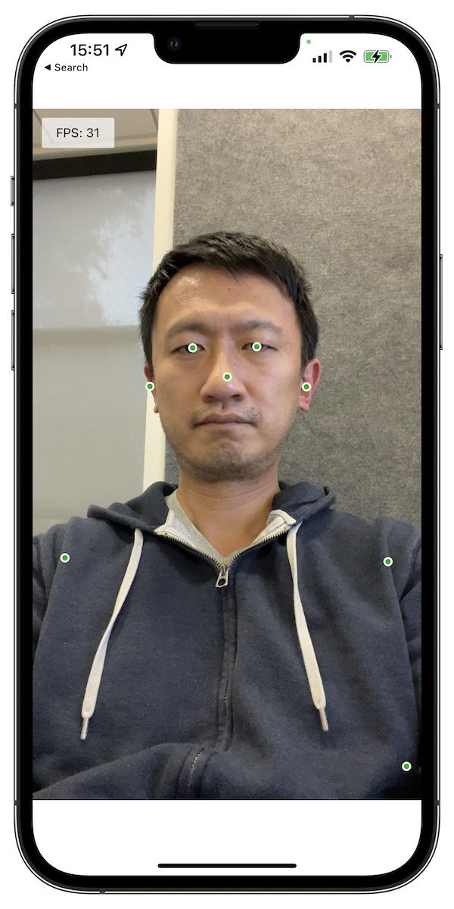

# Info

**This repository is a copy from https://github.com/tensorflow/tfjs/tree/master/tfjs-react-native and has only dependencies 
upgraded**

E.g. Expo is now on Version 49 (before: 46)

# Overview

A quick demo for running [TFJS Pose Detection][posedetection] model
([MoveNet.SinglePose.Ligntning][tfhub]) using
[TFJS React Native][tfjs-react-native] in an Expo project. It supports both
portrait and landscape mode with front and back camera. Only the keypoints are
rendered in the demo.

To run it locally:

```
$ yarn
$ yarn start
```

Then scan the QR code to open it in the `Expo Go` app.

If the app crashes on startup, see [here][readme] for more info.




[posedetection]: https://github.com/tensorflow/tfjs-models/tree/master/pose-detection
[tfhub]: https://tfhub.dev/google/tfjs-model/movenet/singlepose/lightning/4
[tfjs-react-native]: https://github.com/tensorflow/tfjs/tree/master/tfjs-react-native
[screenshots]: https://photos.app.goo.gl/U972ww4HpaKPK6jEA
[readme]: https://github.com/tensorflow/tfjs-examples/blob/master/react-native/README.md
